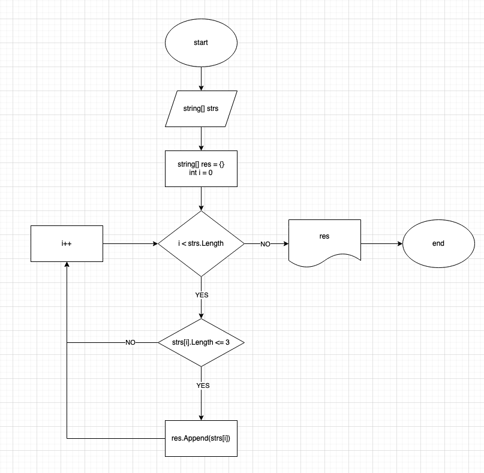

# Финальный проект первого блока

## Задача

Написать программу, которая из имеющегося массива строк формирует массив из строк,
длина которых меньше либо равна 3 символа. Первоначальный массив можно ввести с
клавиатуры, либо задать на старте выполнения алгоритма. При решении не рекомендуется
пользоваться коллекциями, лучше обойтись исключительно массивами.

## Примеры

- `["hello", "2", "world", ":-)"]` -> `["2", ":-)"]`
- `["1234", "1567", "-2", "computer science"]` -> `["-2"]`
- `["Russia", "Denmark", "Kazan"]` -> `[]`

## Решение

Наша программа будет ходить по каждому элементу в массиве и смотреть, подходит ли
оно условиям, то есть меньше либо равна строка 3 символам. Если строка не равна,
то проходит дальше, а если равна, то добавляется строка (Append).

Процесс добавления происходит следующим образом:

1. Создаётся новый массив на 1 элемент больше.
2. Копируется всё из прошлого массива в новый.
3. Последний элемент равен новой строке.
4. Переназначить финальный массив.
